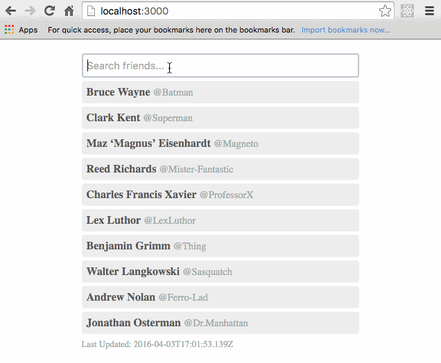

# Friend List
This solution is an implementation of the problem described here: [friend-list](https://github.com/DerekCuevas/friend-list). This example adds a mock api which fails approximately one out of five requests.



## To run
```sh
npm install
npm start
```
